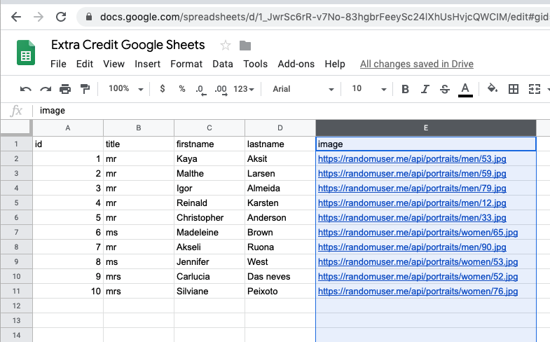

#
#Hackathon Prep Lesson #1
#

<h1>Hackathon Prep Lesson #1 - JSON Format</h1>

<h2>Goal: Using the example code Python "getApiData.py" do the following:</h2>
 
----> Update Code to format all fields into a comma separator list CSV file that can be opened in Google Sheets.

<h2>NOTE: You need to know how to install a python module requests with pip and some basic python print formatting tricks.  See references at end of document.
</h2>

<h2>Extra Credit: Run in Openshift and link to a fork of the following github<h2>
<PRE>https://github.com/devcmgm/hackathonprep2020.git</PRE>
<a href="SetupOpenShift.pdf">Instructions for setting up Open Shift Python</a>

<h1>Final output should look like this.</h1>

Output should look like this</a>
<h1>Excel - Extra Credit Format Test</h1>
Output should look like this</a>

<h1>Key references:</h1>
<UL>
<LI>https://www.w3schools.com/python</LI>
<LI>https://www.w3schools.com/python/python_json.asp</LI>
<LI>https://pypi.org/project/requests</LI>
  <LI>https://www.mongodb.com/cloud</LI>
</UL>

