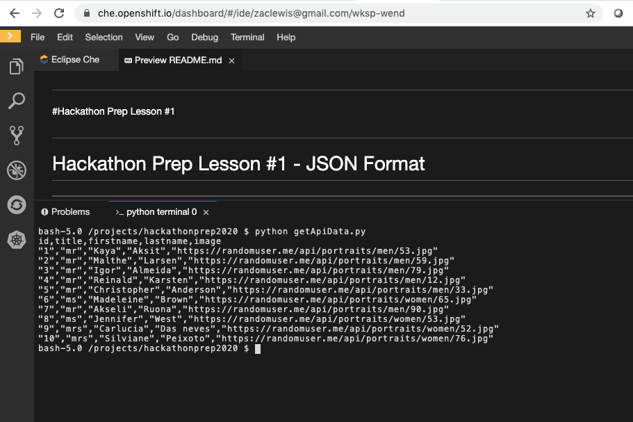

#
#Hackathon Prep Lesson #1
#

<h1>Hackathon Prep Lesson #1 - JSON Format</h1>

Goal: using the example code Python "getApiData.py" do the following:

---->  1:) Update Code to format all fields into a comma separator list CSV file that can be opened in Google Sheets.

<h2>Extra Credit: Run in Openshift and link to a fork of the following github<h2>
<PRE>https://github.com/devcmgm/hackathonprep2020.git</PRE>
Output should look like this</a>

Key references:
<UL>
<LI>https://mrfullstack.tech/fetch-data-using-react-hooks</LI>
<LI>https://github.com/mrfullstack/react-hooks-api-call</LI>
  <LI>https://n161.tech/api/dummyapi/user</LI>
</UL>

